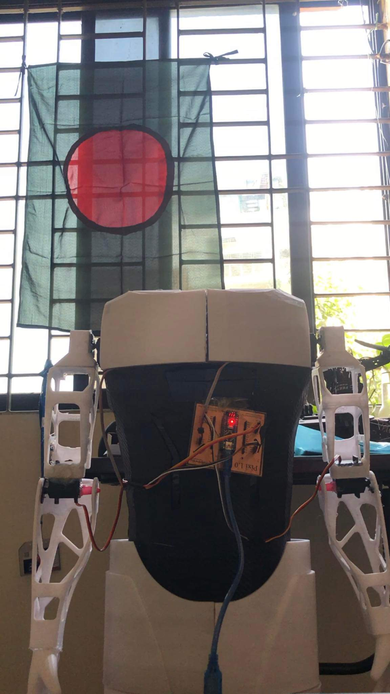

# Pixi v1.0 Introduction
This project aims to create a humanoid robot that can recognize human faces and voices using computer vision and deep learning techniques. The robot is designed to interact with humans in a natural way, recognizing them by their faces and responding to their voice commands.
The project is built using a combination of software and hardware components, including:
1. Raspberry Pi 4B
2. USB Webcam
3. USB microphone
4. USB Sound Card
5. Arduino Nano
5. 4 Servos
6. 3D printed humanoid robot body

### Setup
To set up the project, follow these steps:

1. Clone the repository to your local machine.
2. Install the required libraries listed in the requirements.txt file.
3. Connect the USB Camera Module, USB Speaker and the USB microphone to the Raspberry Pi.
4. Flash the operating system onto the Raspberry Pi and configure it to run headlessly.
5. Run the main program using the command python pixi_new.py.

### Usage
The robot is designed to recognize human faces and respond to voice commands. The robot's behavior is controlled by the main.py program, which runs on the Raspberry Pi.
To interact with the robot, stand in front of it and wait for it to recognize your face. Once it recognizes you, you can give it voice commands, such as "Hello Pixi" or "What is your name?". The robot will respond to your commands in a natural way, using synthesized speech and robotic movements.

### Preview

### Contributing
Contributions to the project are welcome! If you would like to contribute, please follow these steps:

1. Fork the repository on GitHub.
2. Make your changes to the code.
3. Test your changes thoroughly.
4. Submit a pull request with your changes.
5. Please make sure your changes are well-documented and adhere to the project's coding standards.

### License
This project is licensed under the MIT License. See the LICENSE file for details.

### Acknowledgements
This project was inspired by the work of many researchers and engineers in the fields of computer vision, robotics, and artificial intelligence. We would like to acknowledge their contributions to the field and thank them for their inspiration.
